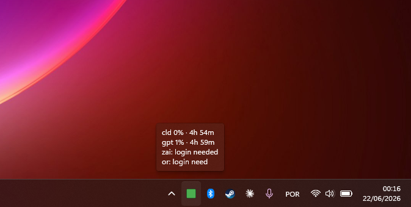
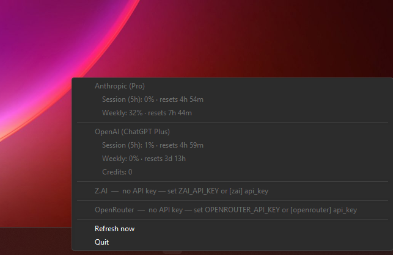

# ai-usagebar-win

I kept losing track of how much of my AI plans I'd burned through —
Claude, Codex, the GLM coding plan, OpenRouter credits — so I built a tiny
**native Windows** app that just sits in the system tray (next to the clock,
Wi-Fi and volume) and shows me, at a glance, how much I've used.

No Electron, no .NET, no background browser. It's a single `~3 MB` `.exe`
written in Rust on top of [`tray-icon`](https://crates.io/crates/tray-icon) +
[`tao`](https://crates.io/crates/tao), talking straight to the Win32
`Shell_NotifyIcon` API. The data side is a reverse-engineering of the Linux
[`ai-usagebar`](https://github.com/akitaonrails/ai-usagebar) Waybar widget,
rewritten for Windows.

Supported providers: **Anthropic (Claude)**, **OpenAI (Codex)**,
**Z.AI (GLM)**, **OpenRouter**, and **DeepSeek**.

## What it looks like

Hover the tray icon for a quick summary:

<!-- Drop your screenshot at screenshots/hover.png (mouse hovering the tray icon) -->


Right-click it for the full breakdown per provider:

<!-- Drop your screenshot at screenshots/menu.png (right-click context menu open) -->


The icon itself changes color with your worst-case usage —
🟢 under 50%, 🟡 50%+, 🟠 75%+, 🔴 90%+ — so you can tell you're running low
without even hovering.

## It won't log you out

This is the part I cared about most: **the app never refreshes your tokens and
never writes to your credential files.** Your `claude` / `codex` CLIs own those
tokens. If this app refreshed them it could rotate the refresh-token out from
under the CLI and silently log you out of your tools — so it simply doesn't.

- It only **reads** the access token that's already on disk.
- If a token has already **expired**, the tray just says *"run `claude`"* /
  *"run `codex login`"* instead of trying to refresh it.
- The API-key providers (Z.AI, OpenRouter, DeepSeek) don't have this problem —
  keys don't expire.

## Download (no Rust needed)

Grab the latest `.exe` from the
[**Releases**](https://github.com/FranzoiDev/ai-usagebar-win/releases) page and
run it. That's it — no installer, no dependencies.

> **First launch:** because the `.exe` isn't code-signed, Windows SmartScreen
> may show *"Windows protected your PC"*. Click **More info → Run anyway**. You
> only have to do this once.

Want it to start with Windows? Press `Win + R`, type `shell:startup`, and drop
a shortcut to the `.exe` in that folder.

## Set up your providers

The app reads whatever's already there. Set up only the ones you use:

| Provider | How it reads usage | What you do once |
|---|---|---|
| Anthropic (Claude) | OAuth from `%USERPROFILE%\.claude\.credentials.json` | Run `claude` and log in |
| OpenAI (Codex) | OAuth from `%USERPROFILE%\.codex\auth.json` | Run `codex login` |
| Z.AI (GLM) | API key | Set `ZAI_API_KEY` (see below) |
| OpenRouter | API key | Set `OPENROUTER_API_KEY` |
| DeepSeek | API key (opt-in) | Set `DEEPSEEK_API_KEY` + enable in config |

For the API-key providers, the easiest way is an environment variable:

```powershell
setx ZAI_API_KEY "your-key-here"
setx OPENROUTER_API_KEY "your-key-here"
```

(Open a **new** terminal after `setx` — it doesn't affect the current one.)

If a provider isn't set up, it just shows *"login needed"* in the menu and the
others keep working — nothing breaks.

## Configuration (optional)

Everything works with no config. If you want to tweak things, copy
[`config.example.toml`](config.example.toml) to
`%APPDATA%\ai-usagebar\config.toml`. You can set:

- `poll_seconds` — how often it refreshes (default 60).
- `[ui] primary` — which provider leads the hover tooltip.
- Per-provider `enabled`, and inline `api_key` if you'd rather not use env vars.

The format matches the Linux `ai-usagebar` config, so an existing file just
works.

## Build it yourself

If you'd rather build from source, install Rust from
[rustup.rs](https://rustup.rs) (accept the Visual Studio Build Tools prompt),
then:

```powershell
git clone https://github.com/FranzoiDev/ai-usagebar-win.git
cd ai-usagebar-win
cargo build --release
.\target\release\ai-usagebar-win.exe
```

The release build hides the console window (it's a tray app). While developing,
run `cargo run` instead so you can see log output, and `cargo test` to run the
suite.

## How it works

```
                ┌──────────────────────────── poll thread ───────────────┐
%USERPROFILE%\… │ read creds (read-only) → GET usage endpoints (reqwest) │
  env / config  │ → parse into a VendorSnapshot                          │
                └───────────────┬────────────────────────────────────────┘
                                │ EventLoopProxy::send_event(Update)
                ┌───────────────▼──────────── UI thread (tao) ────────────┐
                │ render → set tray icon color + tooltip + context menu   │
                └─────────────────────────────────────────────────────────┘
```

A background thread polls every provider on an interval and ships the results
to the UI thread, which owns the tray icon (Win32 requires this) and repaints.

| File | Responsibility |
|---|---|
| `src/usage.rs` | Snapshot model + severity tiers + countdown formatting |
| `src/creds.rs` | Read-only Claude/Codex credential readers (expiry check, **no refresh**) |
| `src/config.rs` | Config + API-key / credential-path resolution |
| `src/vendors/` | One module per provider: endpoint + wire types + parse |
| `src/render.rs` | Snapshot → tooltip + menu lines + icon severity |
| `src/tray.rs` | In-code RGBA icon generation (no asset files) |
| `src/main.rs` | `tao` event loop + background poll thread |

The usage endpoints are all undocumented (reverse-engineered), so they may
change over time:

| Provider | Endpoint |
|---|---|
| Anthropic | `GET https://api.anthropic.com/api/oauth/usage` (`anthropic-beta: oauth-2025-04-20`) |
| OpenAI | `GET https://chatgpt.com/backend-api/wham/usage` |
| Z.AI | `GET https://api.z.ai/api/monitor/usage/quota/limit` (key in `Authorization`, **no** `Bearer`) |
| OpenRouter | `GET https://openrouter.ai/api/v1/credits` + `/key` |
| DeepSeek | `GET https://api.deepseek.com/user/balance` |

## Roadmap

It's an MVP, but a working one — all five providers, tray icon + tooltip + menu,
strictly read-only auth. Things I might add next:

- Draw the actual percentage *number* into the tray icon.
- "Open config" / "Re-login" shortcuts in the menu.
- Cycling the leading provider, like the Linux version's scroll-to-cycle.

## Credits

Data layer reverse-engineered from
[akitaonrails/ai-usagebar](https://github.com/akitaonrails/ai-usagebar).
Built for Windows, MIT-licensed.
